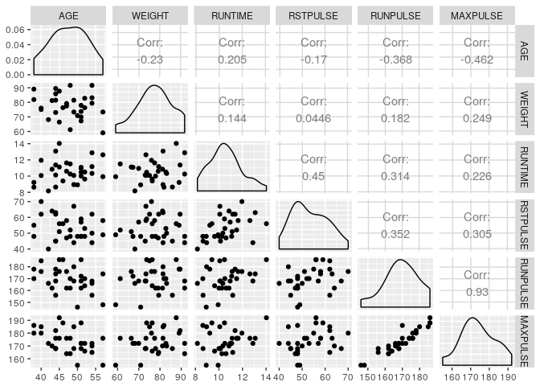
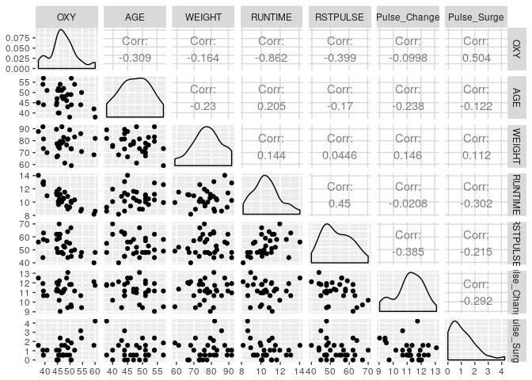
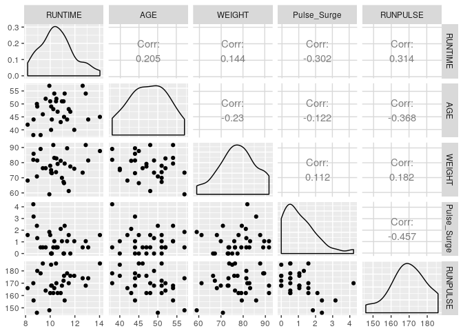
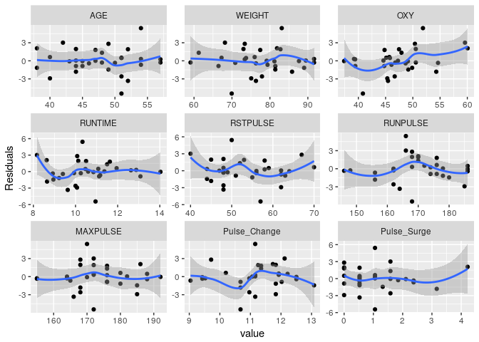
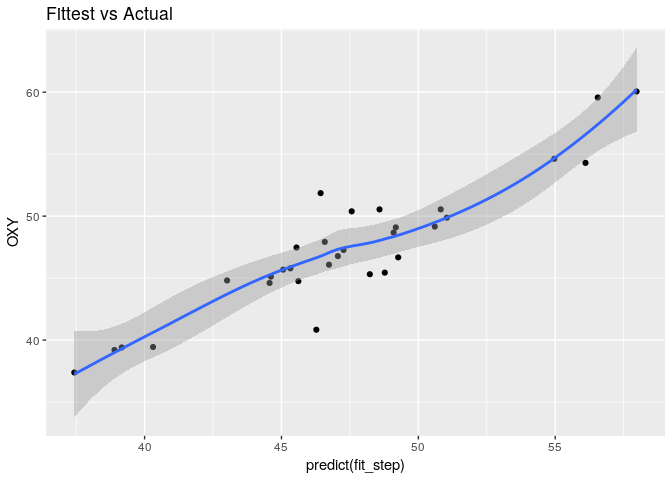
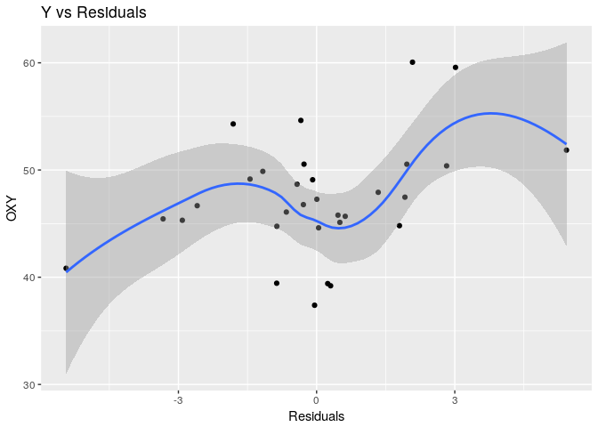
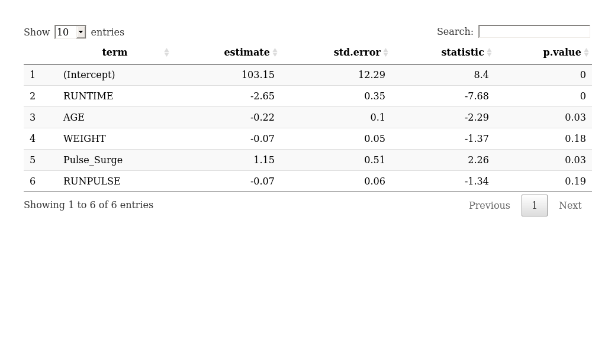
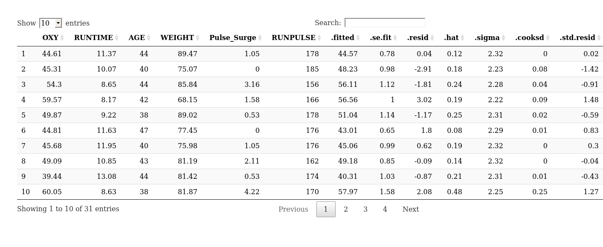

Deleting Variables from an Existing Model
================
Chase Baggett

Introduction
============

Often times, we have an assumption about certain important variables, and we are looking to challenge those assumptions. In this project, I am scrutinizing variables we presume to have an impact on oxygen consumption.

We have a fully fit model with linear additive terms, and no interractions. The purpose of this analysis will be to scrutinize the included terms and evaluate potential interractions, using first principle assumptions, as well as diagnostic techniques, to ultimately form a better model than the original.

Given the small size of the dataset, and without strong first principle knowledge of this area, I am not comfortable evaluating interractions. The danger of overfitting is considerable with only 31 observations, so I am largely assuming there is not interraction unless I see strong evidence otherwise.

Data
====

The data comes from a study conducted at North Carolina State University.

Analyses
========

Fitting the Initial Model
-------------------------

First, let's glance at the model and see what the fit looks like initially.

We see immediately the model is at least a decent fit to the data, but looking at Tables 1 & 2, we see that most of the significance is driven by the pulse data and age.

``` r
round_df <- function(df, digits) {
  nums <- vapply(df, is.numeric, FUN.VALUE = logical(1))

  df[,nums] <- round(df[,nums], digits = digits)

  (df)
}
library(magrittr)
library(broom)
library(ggplot2)
library(DT)
library(car)
library(knitr)
library(reshape)
options(digits=4)

fitness = read.table("fitness.dat", sep="\t", header=T)
fitness.lm = lm(OXY ~ ., data=fitness) 

kable(glance(fitness.lm))
```

|  r.squared|  adj.r.squared|  sigma|  statistic|  p.value|   df|  logLik|    AIC|    BIC|  deviance|  df.residual|
|----------:|--------------:|------:|----------:|--------:|----:|-------:|------:|------:|---------:|------------:|
|     0.8488|          0.811|  2.316|      22.46|        0|    7|  -66.05|  148.1|  159.6|     128.7|           24|

Looking for Collinearity of Our Predictors
------------------------------------------

As we see in Plot 1, Max Pulse and Running Pulse are .93 correlated. I am going to replace them with two features that I believe will present their meaning more clearly to the model.

### Pulse Change

This is the change from resting to running pulse. We can then think of the change as a measure of stress on someone's body, accounted for differences in natural resting pulse.

### Pulse Surge

This is the change from running to the max pulse during the run. The idea is that more in shape people will have less severe surges in heart rate.

These two features help us to capture the marginal heart of the two events, which reduces collinearity in our predictors because we are taking out the underlying drivers of the collinearity, in that heart rate increases from a baseline when it changes, or when it surges. We can see evidence of this by comparing Plot 1 to Plot 2, and we see below that the overall fit of our model is unaffected, with the same *R*<sup>2</sup>.

``` r
fitness$Pulse_Change <- (fitness$RUNPULSE - fitness$RSTPULSE)
fitness$Pulse_Surge <- (fitness$MAXPULSE - fitness$RUNPULSE)
fitness$Pulse_Change <- fitness$Pulse_Change/sd(fitness$Pulse_Change)
fitness$Pulse_Surge <- fitness$Pulse_Surge/sd(fitness$Pulse_Surge)

fit <- lm(OXY ~ RUNTIME + AGE + WEIGHT + RSTPULSE + Pulse_Change + Pulse_Surge, data=fitness)
kable(glance(fit))
```

|  r.squared|  adj.r.squared|  sigma|  statistic|  p.value|   df|  logLik|    AIC|    BIC|  deviance|  df.residual|
|----------:|--------------:|------:|----------:|--------:|----:|-------:|------:|------:|---------:|------------:|
|     0.8488|          0.811|  2.316|      22.46|        0|    7|  -66.05|  148.1|  159.6|     128.7|           24|

Check for Outliers
------------------

We'll use the bonferonni adjusted p to account for the fact that we are performing multiple tests. We see a record that is questionable, but fails to meet significance after adjustment for the number of tests we are performing. Ideally, we'd go back to the research team and ask them to check if there was a typo or problem with this record.

Since we cannot do that, we either leave it in or take it out largely based upon whether or not we believe it represents the underlying data.

``` r
outlierTest(fit)
```

    ## 
    ## No Studentized residuals with Bonferonni p < 0.05
    ## Largest |rstudent|:
    ##    rstudent unadjusted p-value Bonferonni p
    ## 15    2.877           0.008512       0.2639

If we were to remove the one outlier, our *R*<sup>2</sup> would improve significantly.

``` r
fitness2 <- rbind(fitness[1:14,],fitness[16:nrow(fitness),])
fit2 <- lm(OXY ~ RUNTIME + AGE + WEIGHT + RSTPULSE + Pulse_Change + Pulse_Surge, data=fitness2)
kable(glance(fit2))
```

|  r.squared|  adj.r.squared|  sigma|  statistic|  p.value|   df|  logLik|    AIC|    BIC|  deviance|  df.residual|
|----------:|--------------:|------:|----------:|--------:|----:|-------:|------:|------:|---------:|------------:|
|     0.8861|         0.8563|  2.029|      29.81|        0|    7|   -59.8|  135.6|  146.8|     94.64|           23|

However, including or excluding this record has a pretty significant impact on our intercept as well as the coefficient of Pulse Change.

``` r
model_1 <- tidy(fit)[,c("term","estimate","p.value")]
model_2 <- tidy(fit2)[,c("term","estimate","p.value")]
colnames(model_1) <- c("term","Incl. Coef","Incl. P")
colnames(model_2) <- c("term","Excl. Coef","Excl. P")
model_change <- merge(model_1,model_2,by="term")
kable(model_change)
```

| term          |  Incl. Coef|  Incl. P|  Excl. Coef|  Excl. P|
|:--------------|-----------:|--------:|-----------:|--------:|
| (Intercept)   |    104.0340|   0.0000|    109.3723|   0.0000|
| AGE           |     -0.2336|   0.0323|     -0.3059|   0.0033|
| Pulse\_Change |     -0.7529|   0.2145|     -0.8220|   0.1261|
| Pulse\_Surge  |      1.1434|   0.0373|      1.1523|   0.0184|
| RSTPULSE      |     -0.0961|   0.2589|     -0.1046|   0.1643|
| RUNTIME       |     -2.5910|   0.0000|     -2.4601|   0.0000|
| WEIGHT        |     -0.0750|   0.1823|     -0.1043|   0.0439|

Given that Pulse Change's p value seems nonsigniciant, let's true some stepwise selection to see if it increases our AIC, which will weigh the value against model complexity using a penalty.

We see that it removes several of our predictors. However, now that we no longer have change in, we can add back in our previous collinear terms, and attempt stepwise again, and see that it survives.

``` r
fit_step <- step(fit,direction="both",k=2,trace = F)
fit_step <- update(fit_step,"~. + RUNPULSE")
fit_step <- step(fit_step,direction="both",k=2,trace = F)
kable(glance(fit_step))
```

|  r.squared|  adj.r.squared|  sigma|  statistic|  p.value|   df|  logLik|    AIC|    BIC|  deviance|  df.residual|
|----------:|--------------:|------:|----------:|--------:|----:|-------:|------:|------:|---------:|------------:|
|      0.848|         0.8176|  2.275|       27.9|        0|    6|  -66.13|  146.3|  156.3|     129.4|           25|

``` r
kable(tidy(fit_step))
```

| term         |  estimate|  std.error|  statistic|  p.value|
|:-------------|---------:|----------:|----------:|--------:|
| (Intercept)  |  103.1516|    12.2872|      8.395|   0.0000|
| RUNTIME      |   -2.6518|     0.3453|     -7.679|   0.0000|
| AGE          |   -0.2248|     0.0981|     -2.293|   0.0305|
| WEIGHT       |   -0.0729|     0.0533|     -1.367|   0.1837|
| Pulse\_Surge |    1.1514|     0.5089|      2.263|   0.0326|
| RUNPULSE     |   -0.0743|     0.0555|     -1.338|   0.1929|

At this point, I feel like we have a solid model without collinear terms. A couple of our terms have nonsignificant p-values, but provide information to the model during selection.

Plots and Tables
================

Plots
-----

Plot 1

``` r
library(GGally)
ggpairs(fitness[,c("AGE","WEIGHT","RUNTIME","RSTPULSE","RUNPULSE","MAXPULSE")])
```



Plot 2

``` r
ggpairs(fitness[,c("OXY","AGE","WEIGHT","RUNTIME","RSTPULSE","Pulse_Change","Pulse_Surge")])
```



Plot 3 Pairs Plot of Final Model Predictors

``` r
ggpairs(fitness[,rownames(as.data.frame(fit_step$coefficients))[-1]])
```



Plot4

``` r
fitness$Residuals <- fit_step$residuals
m <- melt(fitness,id="Residuals")
ggplot(m,aes(y=Residuals,x=value)) + geom_point() + geom_smooth(method='loess') + facet_wrap(~variable,scales="free")
```



Plot 5

``` r
ggplot(fitness,aes(y=OXY,x=predict(fit_step))) + 
  geom_point() + 
  geom_smooth(method='loess') + 
  ggtitle("Fittest vs Actual")
```



Plot 6

``` r
ggplot(fitness,aes(y=OXY,x=Residuals)) + 
  geom_point() + 
  geom_smooth(method='loess') + 
  ggtitle("Y vs Residuals")
```

 \#\#Tables Table 1 Final Model Fit

``` r
datatable(round_df(tidy(fit_step),digits = 2))
```



Table 2 Augment Table for Record Level Diagnostics

``` r
datatable(round_df(augment(fit_step),digits = 2))
```



Conclusions
===========

What we've learned along the way is that the change from running pulse to max pulse during the exercise is important, as is how fast the person runs, as well as their age. Many other features might be predictively useful, but are hard to prove are significant. For diagnostics, I would use model 1, as it gives us that most useful information about how things change. The separation of pulses into Change and Surge makes it very easy to interpret.

However, for prediction I would use model 2, as it is likely to be more stable, as we removed 2 terms that did not prove useful during automated selection, and added one that did, but is presented in a way that makes it hard to interpret.

Model 1
-------

A transformed version of the original model without collinearity.

``` r
kable(glance(fit))
```

|  r.squared|  adj.r.squared|  sigma|  statistic|  p.value|   df|  logLik|    AIC|    BIC|  deviance|  df.residual|
|----------:|--------------:|------:|----------:|--------:|----:|-------:|------:|------:|---------:|------------:|
|     0.8488|          0.811|  2.316|      22.46|        0|    7|  -66.05|  148.1|  159.6|     128.7|           24|

``` r
kable(tidy(fit))
```

| term          |  estimate|  std.error|  statistic|  p.value|
|:--------------|---------:|----------:|----------:|--------:|
| (Intercept)   |  104.0340|    12.7492|      8.160|   0.0000|
| RUNTIME       |   -2.5910|     0.3907|     -6.632|   0.0000|
| AGE           |   -0.2336|     0.1028|     -2.273|   0.0323|
| WEIGHT        |   -0.0750|     0.0546|     -1.373|   0.1823|
| RSTPULSE      |   -0.0961|     0.0831|     -1.156|   0.2589|
| Pulse\_Change |   -0.7529|     0.5905|     -1.275|   0.2145|
| Pulse\_Surge  |    1.1434|     0.5185|      2.205|   0.0373|

Model 2
-------

A version which has removed variables that did not stand up to backward and forward selection.

``` r
kable(glance(fit_step))
```

|  r.squared|  adj.r.squared|  sigma|  statistic|  p.value|   df|  logLik|    AIC|    BIC|  deviance|  df.residual|
|----------:|--------------:|------:|----------:|--------:|----:|-------:|------:|------:|---------:|------------:|
|      0.848|         0.8176|  2.275|       27.9|        0|    6|  -66.13|  146.3|  156.3|     129.4|           25|

``` r
kable(tidy(fit_step))
```

| term         |  estimate|  std.error|  statistic|  p.value|
|:-------------|---------:|----------:|----------:|--------:|
| (Intercept)  |  103.1516|    12.2872|      8.395|   0.0000|
| RUNTIME      |   -2.6518|     0.3453|     -7.679|   0.0000|
| AGE          |   -0.2248|     0.0981|     -2.293|   0.0305|
| WEIGHT       |   -0.0729|     0.0533|     -1.367|   0.1837|
| Pulse\_Surge |    1.1514|     0.5089|      2.263|   0.0326|
| RUNPULSE     |   -0.0743|     0.0555|     -1.338|   0.1929|
